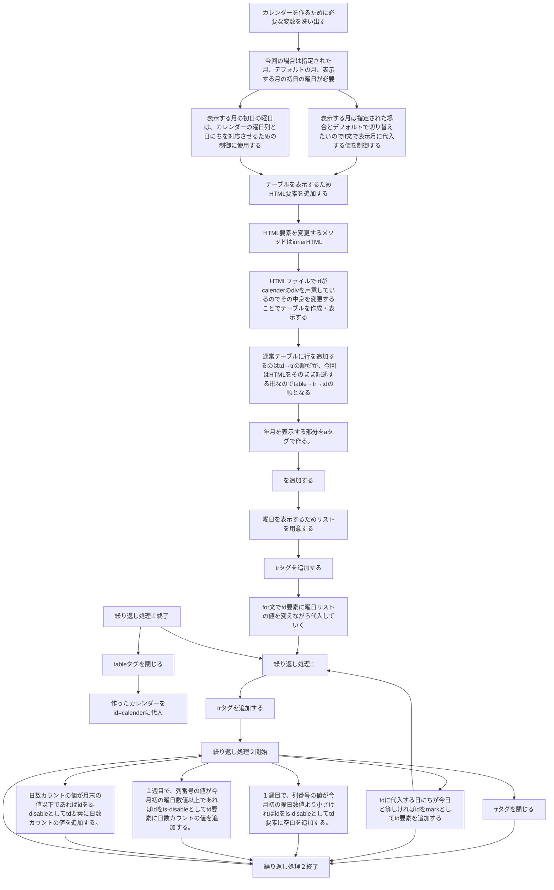

```mermaid

graph TD;
First[カレンダーを作るために必要な変数を洗い出す]
--> B[今回の場合は指定された月、デフォルトの月、表示する月の初日の曜日が必要]
--> C[表示する月は指定された場合とデフォルトで切り替えたいのでif文で表示月に代入する値を制御する]
B --> D[表示する月の初日の曜日は、カレンダーの曜日列と日にちを対応させるための制御に使用する]
C --> E[テーブルを表示するためHTML要素を追加する]
D --> E
E --> F[HTML要素を変更するメソッドはinnerHTML]
F --> G[HTMLファイルでidがcalenderのdivを用意しているのでその中身を変更することでテーブルを作成・表示する]
G --> H[通常テーブルに行を追加するのはtd→trの順だが、今回はHTMLをそのまま記述する形なのでtable→tr→tdの順となる]
H --> I[年月を表示する部分をaタグで作る。]
I --> J[<table>を追加する]
J --> K[曜日を表示するためリストを用意する]
K --> L[trタグを追加する]
L --> M[for文でtd要素に曜日リストの値を変えながら代入していく]
M --> N[繰り返し処理１]
Z --> O[tableタグを閉じる]
O --> P[作ったカレンダーをid=calenderに代入]


N --> R[trタグを追加する]
R --> S[繰り返し処理２開始]
S --> T[trタグを閉じる]
T --> Y
S --> U[tdに代入する日にちが今日と等しければidをmarkとしてtd要素を追加する]
S --> V[１週目で、列番号の値が今月初の曜日数値より小さければidをis-disableとしてtd要素に空白を追加する。]
S --> W[１週目で、列番号の値が今月初の曜日数値以上であればidをis-disableとしてtd要素に日数カウントの値を追加する。]
S --> X[日数カウントの値が月末の値以下であればidをis-disableとしてtd要素に日数カウントの値を追加する。]
U --> N
U --> Y[繰り返し処理２終了]
V --> Y
W --> Y
X --> Y
Y --> S
Z[繰り返し処理１終了]
Z --> N

```