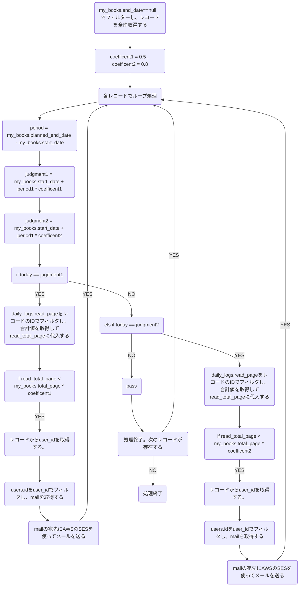

```mermaid

graph TD;
First(my_books.end_date==null　でフィルターし、レコードを全件取得する)
-->B(coefficent1 = 0.5 , coefficent2 = 0.8 )
-->C(各レコードでループ処理)
-->D(period = my_books.planned_end_date - my_books.start_date)
-->E(judgment1 = my_books.start_date + period1 * coefficent1)
-->E2(judgment2 = my_books.start_date + period1 * coefficent2)
-->F(if today == jugdment1)
F-->|YES|G(daily_logs.read_pageをレコードのIDでフィルタし、合計値を取得してread_total_pageに代入する)
-->H(if read_total_page < my_books.total_page * coefficent1)
-->|YES|I(レコードからuser_idを取得する。)
-->J(users.idをuser_idでフィルタし、mailを取得する)
-->K(mailの宛先にAWSのSESを使ってメールを送る)
-->|YES|C
F-->|NO|L(els if today == judgment2)
L-->|YES|M(daily_logs.read_pageをレコードのIDでフィルタし、合計値を取得してread_total_pageに代入する)
-->N(if read_total_page < my_books.total_page * coefficent2)
-->|YES|O(レコードからuser_idを取得する。)
-->P(users.idをuser_idでフィルタし、mailを取得する)
-->Q(mailの宛先にAWSのSESを使ってメールを送る)
-->|YES|C
L-->|NO|R(pass)
-->S(処理終了。次のレコードが存在する)
-->|YES|C
S-->|NO|T(処理終了)
```